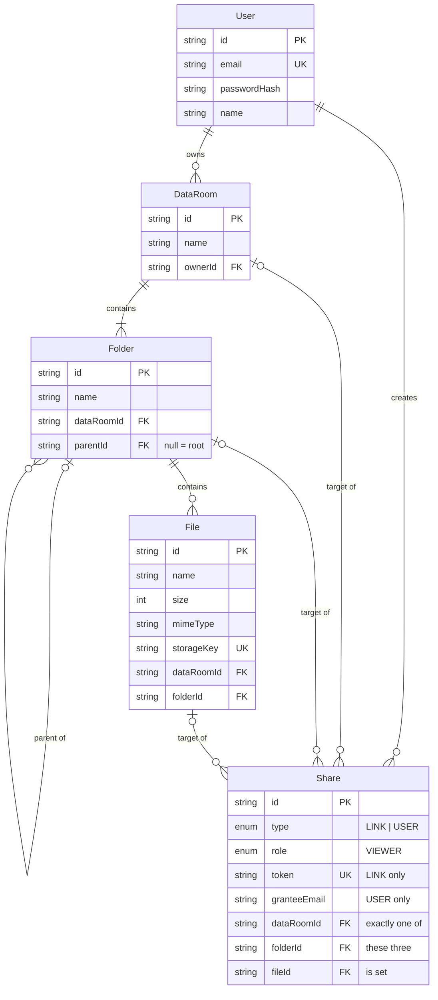

# Acme Data Room

A virtual Data Room MVP for due diligence: secure document storage with folders, PDF viewing, and granular sharing (public links + per-user permissioned access).

**Live demo:** https://acme-dataroom-zeta.vercel.app · **API:** https://dataroom-api-k14s.onrender.com

> The API runs on Render's free tier, which sleeps after inactivity — the first request may take ~50 seconds to wake it. Register two accounts (one in a normal window, one in incognito) to try the sharing flows end to end.

---

## Features

- **Auth** — email/password registration & login (JWT). Every new user gets a Data Room out of the box; a Data Room is visible only to its owner unless shared.
- **Folders** — create, nest arbitrarily deep, rename, delete with a warning that shows exactly how many files/folders and how many bytes will be removed. Breadcrumb navigation.
- **Files** — multi-file upload with drag-and-drop and a per-file progress panel, in-app PDF viewer, rename, move to another folder (tree picker), download, delete.
- **Name conflicts** — uploads are auto-suffixed (`report.pdf` → `report (1).pdf`); rename/move into a conflict returns a clear inline error. Uniqueness is enforced by DB constraints, not just UI checks.
- **Sharing** — share a whole Data Room, a folder, or a single file:
  - **Public link** — anyone with the link gets read-only access to the item and its subtree; the link can be disabled at any time.
  - **Permissioned share** — grant a specific email read-only access; the recipient signs in and finds the item under *Shared with me*. Revocable per person.
  - Recipients can never escape the shared subtree (breadcrumbs are trimmed to the shared root, and the API re-validates scope on every request).
- **Search** *(extra credit)* — find files and folders by name across a Data Room, with full paths in results.
- Multiple Data Rooms per user (create/rename/delete rooms).

## Architecture

```
Next.js 16 (App Router, Tailwind, React Query)   → Vercel
        │  REST + JWT
NestJS 11 API (Prisma)                            → Render
        │                        │
PostgreSQL (Supabase/Neon)       S3-compatible blob storage
                                 (Supabase Storage / AWS S3 / MinIO locally)
```

- **Frontend** (`frontend/`): Next.js + TypeScript + Tailwind, shadcn-style UI components on Radix primitives, TanStack Query for server state.
- **Backend** (`backend/`): NestJS + Prisma + PostgreSQL. Uploaded blobs go to any S3-compatible storage via the AWS SDK; the DB stores only metadata.
- **Local dev**: `docker-compose.yml` starts PostgreSQL and MinIO, so the whole stack runs locally with zero external accounts.

### Design decisions

| Decision | Why |
|---|---|
| **Root folder per Data Room** | Files always live in a folder, so a single `UNIQUE(folderId, name)` constraint covers name conflicts everywhere, including "room level". The root folder is rendered under the room's name in breadcrumbs. |
| **DB-enforced uniqueness + retry** | Concurrent uploads of the same name can't race past a UI check; the API catches the unique-violation and re-suffixes. |
| **One `Share` table for links & user grants** | A share targets exactly one of `dataRoomId`/`folderId`/`fileId` via nullable FKs with `ON DELETE CASCADE` — deleting a resource automatically revokes everything pointing at it (no dangling links). `type` distinguishes `LINK` vs `USER`, `role` is `VIEWER` today, extensible to `EDITOR`. |
| **Permission checks resolve ancestors** | Access to a file/folder = owner of the room **or** a `USER` share on the item or any ancestor (folder chain / room). Public links re-validate on every request that the target is inside the shared subtree — a leaked deep URL can't escape scope. |
| **Streaming through the API + short-lived view tokens** | `<iframe>`/`<a>` can't send an `Authorization` header, so viewing/downloading uses a 15-min signed token in the URL. Streaming through the API keeps the storage provider swappable (no presign quirks, no CORS on the bucket) and keeps buckets fully private. |
| **JWT in localStorage** | Pragmatic for an MVP with a separate API domain. Production hardening would move to httpOnly cookies + CSRF protection. |
| **Per-file XHR uploads** | One request per file gives accurate per-file progress and lets one failure not affect the rest of the batch. |

## Data model (ERD)



Key constraints & indexes:

- `UNIQUE(folderId, name)` on `File`, `UNIQUE(parentId, name)` on `Folder` — name conflicts are impossible at the data layer.
- Indexes on `Folder(parentId)`, `Folder(dataRoomId)`, `File(folderId)`, `File(dataRoomId)`, `Share(granteeEmail)`, `Share(token)` — every hot query path is index-backed.
- All child rows cascade on delete, including shares, so deleting a folder atomically removes its subtree and revokes its shares.

## How it scales

**1. Total size / item count of a folder subtree?**
Today: a recursive CTE (`WITH RECURSIVE` over `Folder.parentId`, then `COUNT`/`SUM` over files) — one indexed query, used for the delete-confirmation warning and folder stats. At larger scale: denormalized counters (`totalSize`, `fileCount`) on `Folder`, updated transactionally (or via async jobs) on upload/delete/move — turning the read into O(1) at the cost of write-side bookkeeping. The CTE stays as the reconciliation source of truth.

**2. What changes with 100,000 files in one Data Room?**
- **Listing**: never return a whole room — the API already lists per folder. Add cursor-based pagination (`WHERE (name, id) > ($cursor) ORDER BY name, id LIMIT 50`), which is stable under inserts, plus virtualized rendering client-side.
- **Indexes**: the composite unique indexes `(folderId, name)` / `(parentId, name)` already serve sorted, paginated listing directly. Search upgrades from `ILIKE` to a `pg_trgm` GIN index on `File(name)` (scoped by `dataRoomId`).
- **Deletes**: deleting a 100k-file folder becomes a background job — mark the subtree deleted (fast, user-visible immediately), then garbage-collect DB rows and blobs asynchronously in batches.
- **Uploads**: switch from streaming through the API to presigned upload URLs so blobs go browser → storage directly; the API only issues URLs and records metadata.
- **Ancestor walks**: breadcrumbs/permission chains are depth-bound (folder depth, not file count) so they're unaffected; a materialized `path` column could remove the loop entirely if depth grew large.

**3. Per-user roles (viewer/editor) without remodeling?**
`Share.role` already exists (`VIEWER`, default). Adding `EDITOR` is: one enum value, a role picker in the share dialog, and the access service returning the resolved role so write endpoints check `role >= EDITOR` instead of `owner only`. The polymorphic share rows, ancestor resolution, and revocation flow are unchanged — permissions were modeled as *(subject, resource, role)* from day one.

## Edge cases handled

- Upload of an existing name → auto-suffix `name (1).pdf` (with a retry loop that survives concurrent uploads racing on the same name).
- Rename/move into a conflict → `409` with a human-readable message shown inline in the dialog.
- Deleting a folder that someone is viewing via a share → cascade removes the share; the viewer gets a clear "link is invalid or access has been revoked" screen, not a crash.
- Public link to a folder: navigating to a folder/file *outside* the shared subtree via crafted URLs → `403` (scope re-validated server-side on every request).
- A share recipient never sees the owner's parent-folder names — breadcrumbs are trimmed to the shared root on the server.
- Root folder can't be deleted or renamed directly (rename the Data Room instead); files can't be moved across Data Rooms.
- Sharing to your own email is rejected; sharing the same email or creating a second public link is idempotent.
- Non-PDF files upload fine but get a graceful "no preview" state with a download button; 50 MB upload limit with a clear error.
- UTF-8 filenames (e.g. Cyrillic) survive upload and download (`filename*=UTF-8''…`).
- Expired view token in an open preview → clean "link expired" error, refetching the preview issues a new one.

## Testing

- **Unit (Vitest)** — pure logic that must not regress: name-conflict auto-suffixing (`backend/src/common/names.spec.ts`) and display formatting (`frontend/src/lib/format.test.ts`). Run with `npm test` in either package.
- **E2E (Playwright)** — `frontend/e2e/dataroom.spec.ts` drives a real browser through the two critical journeys: the owner flow (register → folders → duplicate-name rejection → multi-upload with auto-suffix → preview → delete with warning) and the full public-share lifecycle (create link → anonymous view-only access → disable → revoked screen). Run against the local stack with `npm run test:e2e` (see `playwright.config.ts` for prerequisites).
- Beyond the automated suites, every feature was exercised by hand end-to-end: scripted API calls for edge cases (409 conflicts, revoked shares, scope-escape attempts) and full click-throughs with multiple accounts.

**What I'd add next:** [ts-rest](https://ts-rest.com) to share one typed API contract between the NestJS controllers and the React Query hooks (today the types are mirrored by hand in `frontend/src/lib/types.ts`); Storybook for the dialog/table components; file versioning (a `FileVersion` table keyed by `fileId`, with `File` pointing at the current version — uploads to an existing name become new versions instead of suffixed copies).

## Getting started (local)

Prerequisites: Node 20+, Docker.

```bash
# 1. Infrastructure: PostgreSQL + MinIO (S3) + bucket bootstrap
docker compose up -d

# 2. Backend — http://localhost:4001
cd backend
npm install
npx prisma migrate dev   # applies migrations (uses backend/.env)
npm run start:dev

# 3. Frontend — http://localhost:3001
cd ../frontend
npm install
npm run dev -- -p 3001
```

Open http://localhost:3001, register two accounts in two browsers to try sharing. `backend/.env` and `frontend/.env.local` ship with working local defaults; see the `.env.example` files for every variable.

## Deployment

- **Backend → Render**: the repo contains `render.yaml` (Blueprint). Point Render at the repo, set `DATABASE_URL` (Supabase/Neon), the `S3_*` variables (Supabase Storage exposes an S3-compatible endpoint; AWS S3/R2 work identically) and `CORS_ORIGIN` (your Vercel URL). Migrations run automatically on deploy (`prisma migrate deploy`).
- **Frontend → Vercel**: import the repo, set the root directory to `frontend/`, add `NEXT_PUBLIC_API_URL` pointing at the Render URL.
- **Storage**: create a private bucket named `dataroom` and an access key; no public access or CORS configuration is needed since all traffic goes through the API.

## Where and how AI was used

This project was built AI-centric on purpose — it reflects my normal daily workflow, where an AI agent (Claude Code) does the mechanical work and I own the product end-to-end.

**What I did:** chose the stack and set the architecture; designed the data model (root-folder-per-room, the polymorphic `Share` table, DB-enforced uniqueness) and the API surface; defined the UX flows without a mockup — dialogs, conflict handling, the share/revoke experience; made every trade-off documented above; and acted as the quality gate — reviewed the generated code, caught and fixed the weak spots (e.g. a breadcrumb privacy leak for share recipients, a redirect loop after deleting the last Data Room), and decided when each feature was actually done.

**What the AI did:** generated the implementation code to my spec across backend and frontend, drafted this documentation, and ran structured review passes over the logic chains I flagged as risky — permission resolution through ancestor folders, share revocation, name-conflict races on concurrent uploads.

**How it was verified:** every feature was exercised end-to-end — scripted API flows for the edge cases (409 conflicts, revoked links, scope-escape attempts on public share URLs) and a full click-through of the UI in a real browser with multiple accounts. Where the result didn't match the intent, I iterated until it did. I understand and own all of the code in this repo.
